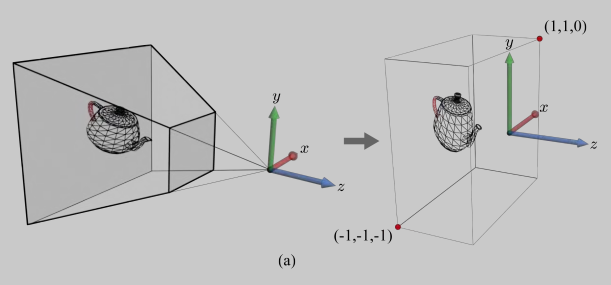
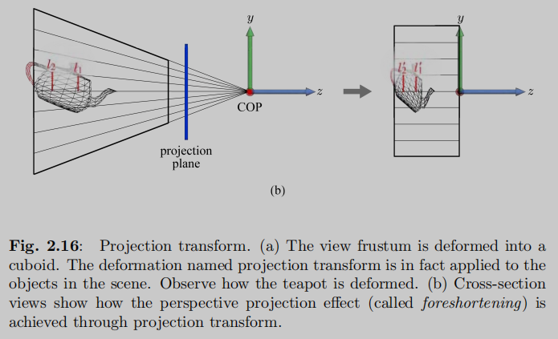
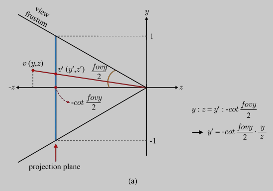
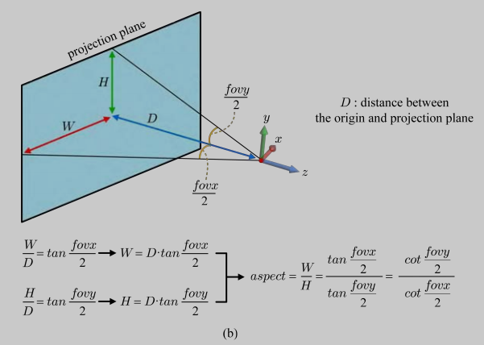
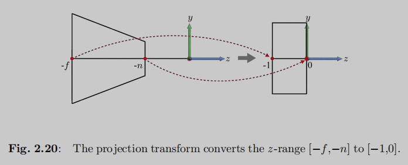

# 透视投影矩阵推导

透视投影变换将模型的顶点坐标由摄像机空间变换到齐次裁剪空间。它将可视体（View Frustum）转换到一个 $2 * 2 * 1$ 大小的长方体中（称为标准可视体，Canonical View Volumn）。DirectX 中默认的标准可视体范围是 $2 * 2 * 1$，OpenGL 中默认的标准可视体范围是 $2 * 2 * 2$。下图展示的是 DirectX 中的默认情况，$x$ 轴向范围在 $[-1,1]$，$y$ 轴向范围在 $[-1,1]$，$z$ 轴向范围在 $[-1, 0]$。

<div align="center">
  
</div>

透视投影会扭曲场景中的对象，使得平行线不再平行。注意观察下图中的 $l_1$ 和 $l_2$ 两条线段，原本 $l_2$ 的长度大于 $l_1$ 的长度，在经过透视投影后， $l_2^\prime$ 的长度等于了 $l_1^\prime$ 的长度，物体发生了形变。

<div align="center">
  
</div>

假设可视体（View Frustum）中的一个顶点 $v(x, y, z)$，被投影变换到 $v^\prime(x^\prime, y^\prime, z^\prime)$。下面让我们来推导透视投影矩阵。注意，这里我们使用右手坐标系，标准可视体的 $z$ 轴向范围在 $[-1, 0]$。

<div align="center">
  
</div>

在推导过程中，投影平面的设定很关键，它被定义在 $z = -\cot{\frac{fovy}{2}}$ 处。

先来计算 $y^\prime$。因为 $y^\prime$ 是投影平面上的坐标，所以它的 $y$ 轴向取值范围在 $[-1, 1]$。根据相似三角形，我们可以得到：

$$
y^\prime = -\cot{\frac{fovy}{2}} \cdot \frac{y}{z} \tag{2.26}
$$

同理，可得

$$
x^\prime = -\cot{\frac{fovx}{2}} \cdot \frac{x}{z} \tag{2.27}
$$

<div align="center">
  
</div>

由于 $fovx$ 未知，已知 $fovy$ 和 $aspect$，根据

$$
aspect = \frac{w}{h} = \frac{\tan{\frac{fovx}{2}}}{\tan{\frac{fovy}{2}}} = \frac{\cot{\frac{fovy}{2}}}{\cot{\frac{fovx}{2}}}
$$

可得

$$
\cot{\frac{fovx}{2}} = \frac{\cot{\frac{fovy}{2}}}{aspect} \tag{2.28}
$$

将 $(2.28)$ 代入 $(2.27)$，可得

$$
x^\prime = -\frac{\cot{\frac{fovy}{2}}}{aspect} \cdot \frac{x}{z} \tag{2.29}
$$

为简单起见，我们将 $\cot{\frac{fovy}{2}}$ 记为 $D$，将 $aspect$ 记为 $A$。

此时，经过透视变换的顶点 $v^\prime$ 可以表示为

$$
v^\prime = (x^\prime, y^\prime, z^\prime, 1)= (-\frac{D}{A} \cdot \frac{x}{z}, -D\frac{y}{z}, z^\prime, 1) \tag{2.30}
$$

其中 $z^\prime$ 仍未知。

由于在齐次坐标系下， $(p, q, r, 1)$ 等价于 $(cp, cq, cr, c)$ 其中 $c \neq 0$。所以我们可以将 $(2.30)$ 中的所有坐标分量乘以 $-z$，得到

$$
(-\frac{D}{A} \cdot \frac{x}{z}, -D\frac{y}{z}, z^\prime, 1) \rightarrow (\frac{D}{A}x, Dy, -zz^\prime, -z) \tag{2.31}
$$

根据 $(2.31)$， $\frac{D}{A}x$， $Dy$，和 $-z$ 是 $x$， $y$ 和 $z$ 的线性组合。所以我们可以用一个矩阵乘法形式来表示，将 $-zz^\prime$ 记为 $z^{\prime\prime}$，则有

$$
\begin{bmatrix}
\frac{D}{A}x \\ Dy \\ z^{\prime\prime} \\ -z
\end{bmatrix} = \begin{bmatrix}
\frac{D}{A} & 0 & 0 & 0 \\
0 & D & 0 & 0 \\
m_1 & m_2 & m_3 & m_4 \\
0 & 0 & -1 & 0
\end{bmatrix}
\begin{bmatrix}
x & \\ y & \\ z & \\ 1
\end{bmatrix}
\tag{2.32}
$$

此 $4\times4$ 矩阵就是透视投影矩阵。其中 $m_1$， $m_2$， $m_3$， $m_4$ 是未知的，需要我们求解。

因为 $z$ 值变化与 $x$ 和 $y$ 无关，所以 $m_1$ 和 $m_2$ 为 0。所以我们可以得到

$$
\begin{bmatrix}
\frac{D}{A} & 0 & 0 & 0 \\
0 & D & 0 & 0 \\
0 & 0 & m_3 & m_4 \\
0 & 0 & -1 & 0
\end{bmatrix} \begin{bmatrix}
x \\ y \\ z \\ 1
\end{bmatrix} = \begin{bmatrix}
\frac{D}{A}x \\ Dy \\ m_3z + m_4 \\ -z
\end{bmatrix} \rightarrow \begin{bmatrix}
-\frac{D}{A} \cdot \frac{x}{z} \\ -D\frac{y}{z} \\ -m_3 - \frac{m_4}{z} \\ 1
\end{bmatrix} = v^{\prime} \tag{2.33}
$$

根据 $(2.33)$，我们可以得到

$$
z^{\prime} = -m_3 - \frac{m_4}{z} \tag{2.34}
$$

<div align="center">
  
</div>

根据透视变换的定义，远裁剪平面处的 $z$ 坐标 $-f$ 和近裁剪平面处的 $z$ 坐标 $-n$ 分别被映射到 $-1$ 和 $0$，将它们代入 $(2.34)$，我们可以得到

$$
-1 = -m_3 + \frac{m_4}{f} \\
0 = -m_3 + \frac{m_4}{n}
\tag{2.35}
$$

解 $(2.35)$，得

$$
m_3 = \frac{f}{f - n} \\
m_4 = \frac{fn}{f - n}
\tag{2.36}
$$

最终，我们得到的投影矩阵为

$$
\begin{bmatrix}
\frac{\cot{\frac{fovy}{2}}}{aspect} & 0 & 0 & 0 \\
0 & \cot{\frac{fovy}{2}} & 0 & 0 \\
0 & 0 & \frac{f}{f - n} & \frac{fn}{f - n} \\
0 & 0 & -1 & 0
\end{bmatrix}
$$

对于另外一种情况，如果标准可视体的 $z$ 轴范围是 $[-1, 1]$，远裁剪平面处的 $z$ 坐标 $-f$ 和近裁剪平面处的 $z$ 坐标 $-n$ 分别被映射到 $-1$ 和 $1$，则式（2.35）变为

$$
-1 = -m_3 + \frac{m_4}{f} \\
1 = -m_3 + \frac{m_4}{n} \tag{2.37}
$$

解 $(2.37)$，得

$$
m_3 = \frac{f + n}{f - n} \\
m_4 = \frac{2nf}{f - n}
$$

则得到的投影矩阵为

$$
\begin{bmatrix}
\frac{\cot{\frac{fovy}{2}}}{aspect} & 0 & 0 & 0 \\
0 & \cot{\frac{fovy}{2}} & 0 & 0 \\
0 & 0 & \frac{f + n}{f - n} & \frac{2nf}{f - n} \\
0 & 0 & -1 & 0
\end{bmatrix}
$$

## 总结

当标准可视体 $z$ 轴向范围在 $[-1, 0]$ 时，透视投影变换矩阵为：

$$
\begin{bmatrix}
\frac{\cot{\frac{fovy}{2}}}{aspect} & 0 & 0 & 0 \\
0 & \cot{\frac{fovy}{2}} & 0 & 0 \\
0 & 0 & \frac{f}{f - n} & \frac{fn}{f - n} \\
0 & 0 & -1 & 0
\end{bmatrix}
$$

对应代码为：

```cpp
mat4 getPerspectiveMatrix(float fovy, float aspect, float zNear, float zFar)
{
    // 注意：
    // 1. 此处矩阵采用列主序存储, result[0] 表示矩阵的第一列
    // 2. fovy 为弧度值

    float tanHalfFovy = tan(fovy / 2.f);

    mat4 result(0.f);
    result[0][0] = 1.f / (aspect * tanHalfFovy);
    result[1][1] = 1.f / tanHalfFovy;
    result[2][2] = zFar / (zFar - zNear);
    result[2][3] = -1.f;
    result[3][2] = (zNear * zFar) / (zFar - zNear);

    return result;
}
```

当标准可视体 $z$ 轴向范围在 $[-1, 1]$ 时，透视投影变换矩阵为：

$$
\begin{bmatrix}
\frac{\cot{\frac{fovy}{2}}}{aspect} & 0 & 0 & 0 \\
0 & \cot{\frac{fovy}{2}} & 0 & 0 \\
0 & 0 & \frac{f + n}{f - n} & \frac{2nf}{f - n} \\
0 & 0 & -1 & 0
\end{bmatrix}
$$

对应代码为：

```cpp
mat4 getPerspectiveMatrix(float fovy, float aspect, float zNear, float zFar)
{
    // 注意：
    // 1. 此处矩阵采用列主序存储，result[0] 表示矩阵的第一列
    // 2. fovy 为弧度值

    float tanHalfFovy = tan(fovy / 2.f);

    mat4 result(0.f);
    result[0][0] = 1.f / (aspect * tanHalfFovy);
    result[1][1] = 1.f / tanHalfFovy;
    result[2][2] = (zFar + zNear) / (zFar - zNear);
    result[2][3] = -1.f;
    result[3][2] = (2 * zNear * zFar) / (zFar - zNear);

    return result;
}
```

## 参考资料

《3D Graphics for Game Programming》

- 2.4 Projection Transform
