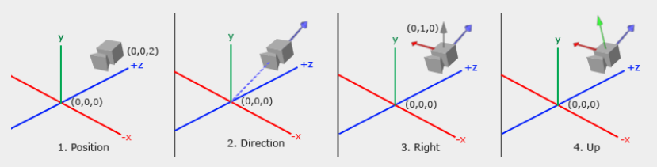

# 视图变换矩阵推导

视图变换矩阵，用于将顶点坐标由世界空间变换到摄像机空间，是图形渲染管线顶点空间变换过程中的一步。为了构建这样一个矩阵，我们要明确由世界空间到摄像机空间需经过哪些变换。

要变换到摄像机空间，就要明确摄像机空间基向量所在，也就是确定摄像机的位置和朝向。为了达成这一目的，我们将摄像机在世界空间中的坐标位置，表示为 `eye`；将摄像机观察目标的坐标位置，表示为 `target`；将摄像机的向上方向，表示为 `up`。

有了摄像机的坐标位置 `eye`，也就确定了摄像机空间的坐标原点。因为摄像机位于摄像机空间的原点处。
通过摄像机观察目标的坐标位置 `target`，可以确定摄像机看向哪个方向，也就是摄像机空间的 `z` 轴朝向。因为摄像机朝向 `-z` 方向。
最后通过摄像机的向上方向 `up`，可以最终锁定摄像机的朝向，也就是确定摄像机空间的 `x` 轴 和 `y` 轴朝向。

有了这三个参数，我们就能够构建出摄像机空间的基向量在世界空间下的表示（注意，这里我们使用的是右手系）。

$$
\begin{align}
z &= \frac{eye - target}{\Vert eye - target \Vert} \\
x &= \frac{up \times z}{\Vert up \times z \Vert} \\
y &= z \times x
\end{align}
$$

这里要注意的一点是，摄像机朝向的是 `-z` 方向，所以是 `eye - target`。这样一来，我们就得到了摄像机空间的基向量在世界空间下的表示。

要构建由世界空间变换到摄像机空间的矩阵，只需要将 `x`、`y`、`z` 三个基向量按行填入目标矩阵即可：

$$
\begin{bmatrix}
x_x & x_y & x_z \\
y_x & y_y & y_z \\
z_x & z_y & z_z
\end{bmatrix}
$$

但仅有这个矩阵还不够，它只完成了旋转变换，将世界空间的坐标系旋转到与摄像机空间的坐标系重合。我们还需要将世界空间的原点与摄像机空间的原点重合，这就需要一个平移变换。由于摄像机在世界空间中的位置是 `eye`，所以对应的平移变换矩阵为：

$$
\begin{bmatrix}
1 & 0 & 0 & -eye_x \\
0 & 1 & 0 & -eye_y \\
0 & 0 & 1 & -eye_z \\
0 & 0 & 0 & 1
\end{bmatrix}
$$

最后，我们将表示旋转变换的矩阵和平移变换的矩阵相乘，就得到了完整的视图变换矩阵：

$$
M_{view} =
\begin{bmatrix}
x_x & x_y & x_z & 0 \\
y_x & y_y & y_z & 0 \\
z_x & z_y & z_z & 0 \\
0 & 0 & 0 & 1
\end{bmatrix}
\begin{bmatrix}
1 & 0 & 0 & -eye_x \\
0 & 1 & 0 & -eye_y \\
0 & 0 & 1 & -eye_z \\
0 & 0 & 0 & 1
\end{bmatrix} =
\begin{bmatrix}
x_x & x_y & x_z & -eye \cdot x \\
y_x & y_y & y_z & -eye \cdot y \\
z_x & z_y & z_z & -eye \cdot z \\
0 & 0 & 0 & 1
\end{bmatrix}
$$

## 参考资料

书籍

- 《3D Graphics for Game Programming》

教程

- `LearnOpenGL` [https://learnopengl.com/](https://learnopengl.com/)

